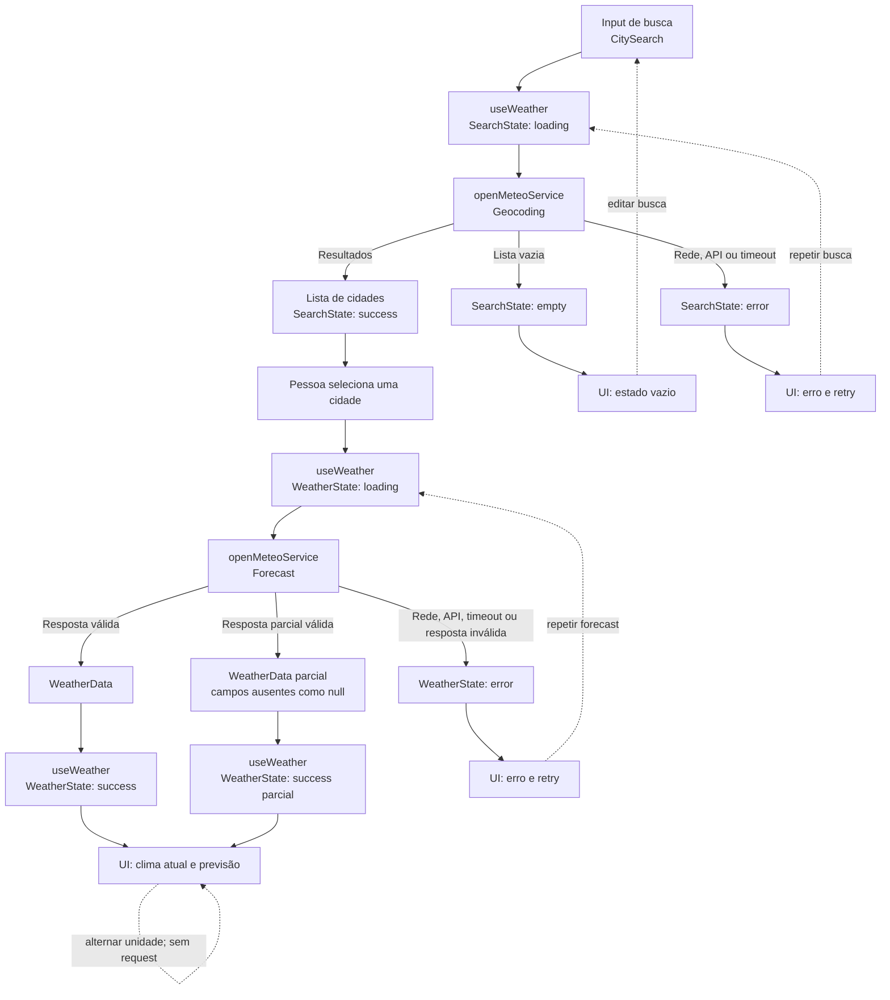

# Plano Técnico — Weather App

**Status:** Proposta técnica derivada da spec em rascunho  
**Fonte da verdade:** `specs/weather-app-spec.md`  
**Princípio:** manter a primeira versão client-side, sem backend, autenticação ou persistência de servidor. Decisões de produto ainda abertas ficam assinaladas como pendências, não como contratos aprovados.

## Architecture

A aplicação será uma SPA responsiva em React organizada em quatro camadas. `components` apresenta dados e emite ações; `hooks` coordena fluxo e estado; `services` executa chamadas HTTP e converte falhas externas em erros de domínio; `lib` contém transformações puras, sem React ou rede. `types` guarda contratos internos e formatos externos relevantes.

```text
Pessoa usuária
  -> CitySearch
  -> useWeather (estado, seleção e coordenação)
  -> openMeteoService
      -> Geocoding API (busca de cidade)
      -> Forecast API (condições atuais + previsão diária)
  -> lib/openMeteoMapper (normalização pura dos payloads)
  -> WeatherSummary + FiveDayForecast + estados acessíveis
```

Fluxo de dependências: `components -> hooks -> services`; `services` usa mapeadores de `lib`, e `hooks`/`components` podem usar funções puras de `lib` quando necessário. `lib` não importa React, não faz I/O e não depende de `services`. Nenhuma camada de apresentação conhece URLs, HTTP ou o formato externo snake_case. Essa separação permite testar cada fronteira sem subir a aplicação nem chamar o provedor real.

Não haverá backend próprio nesta baseline. O navegador fará requisições HTTPS aos endpoints públicos do provedor, após a validação de termos, limites, cobertura, CORS e atribuição exigidos pela spec. Nenhuma chave secreta será incluída no frontend. A separação mantém a integração substituível sem introduzir abstrações genéricas antes de haver necessidade.

## Tech Stack

Fatia de layout mock: `App.tsx` mantém `unit` e compõe os componentes existentes;
`hooks/useMockWeather.ts` coordena estados e retry com uma função injetável,
descartando respostas de consultas anteriores ou após desmontagem.
`services/mockWeatherService.ts` simula latência de 500 ms e retorna somente a
fixture de São Paulo, sem rede e sem fabricar clima para outras localidades.
O estado inicial é `idle`; erro é exercitável por serviço substituto nos testes.
Dados exibidos são identificados como fictícios. A entrada `main.tsx` e o CSS
global habilitam a execução no Vite, sem aprovar contratos pendentes da API.

| Área | Escolha | Justificativa |
| --- | --- | --- |
| Linguagem | TypeScript em modo strict | Tipar contratos de API e estados de carregamento/erro. |
| UI | React 19 | Já é dependência e base da stack do repositório. |
| Build e desenvolvimento | Vite | Já configurado; adequado à SPA client-side. |
| Estilos | Tailwind CSS | Já configurado e definido pelas convenções do projeto. |
| Testes unitários e de componentes | Vitest, Testing Library, user-event | Já instalados; cobrem funções, serviços e interações React. |
| Testes end-to-end | Playwright | Já instalado; cobre fluxos completos com APIs controladas. |
| Lint e formatação | Biome | Já configurado no projeto. |
| Dados meteorológicos | Open-Meteo, sujeito à validação da spec | Geocoding e forecast sem chave de API na direção inicial; termos e limites ainda precisam ser confirmados. |

Não adicionar estado global ou biblioteca de cache nesta fase: há uma única tela/fluxo de consulta e o estado pode viver em um hook próximo à aplicação.

## Project Structure

Estrutura proposta para a implementação, ainda não criada:

```text
src/
  App.tsx                       # Composição da tela e injeção do serviço
  components/
    CitySearch.tsx              # Busca, lista e seleção de localidades
    CurrentWeather.tsx          # Condições atuais
    FiveDayForecast.tsx         # Previsão para cinco datas
    TemperatureUnitToggle.tsx   # Alternância Celsius/Fahrenheit
    WeatherStatus.tsx           # Loading, vazio e falha
  hooks/
    useWeather.ts               # Coordena busca, cidade selecionada e previsão
  services/
    openMeteoService.ts         # HTTP, parâmetros e tradução de falhas do provedor
  lib/
    openMeteoMapper.ts          # Mapeamento puro dos payloads externos para domínio
    temperature.ts              # Conversão e formatação de temperatura
    weatherCode.ts              # Mapeamento do código meteorológico para pt-BR
    localDate.ts                 # Datas no fuso da cidade
  types/
    weather.ts                  # Contratos internos e estados
    openMeteo.ts                # Formatos externos consumidos do provedor
tests/
  lib/                          # Testes unitários sem rede ou React
  services/                     # HTTP com fetch controlado e respostas simuladas
  hooks/                        # Estado/orquestração com serviço substituto
  components/                   # Interações com Testing Library
  e2e/                          # Fluxos Playwright com API mockada
```

Responsabilidades: componentes recebem props/estado e chamam callbacks; o hook controla busca, seleção, unidade, loading, erro e cancelamento; o serviço conhece Open-Meteo e é o único responsável por I/O; `lib` implementa normalização, conversões, datas e códigos como funções puras. `types/weather.ts` não deve depender do payload do provedor; `types/openMeteo.ts` descreve apenas os campos externos consumidos. Seguir a convenção de um componente por arquivo e não criar camadas/pastas adicionais sem um caso de uso.

## Data Model

Fatia de previsão solicitada: `ForecastList.tsx` compõe `ForecastCard.tsx` em
substituição ao componente único proposto. `lib/format.ts` formata datas ISO
locais já normalizadas: a representação intermediária e o `Intl.DateTimeFormat`
usam UTC para preservar o calendário independentemente do fuso do dispositivo.
Datas inválidas têm fallback explícito, sem deslocar nem alterar outros itens.

Os contratos abaixo são internos à aplicação; não representam uma cópia integral do payload de Open-Meteo. `types/openMeteo.ts` descreve a fatia externa necessária e funções puras em `lib/openMeteoMapper.ts` convertem essa fatia para os tipos internos. O conjunto diário definitivo depende da pergunta aberta sobre campos da previsão.

```ts
type Unit = "celsius" | "fahrenheit";

interface City {
  id?: number; // Identificador da localidade no geocoding
  name: string; // Nome da cidade
  admin1?: string; // Estado ou região administrativa
  country?: string; // Nome do país
  countryCode?: string; // Código do país
  latitude: number; // Latitude para consulta meteorológica
  longitude: number; // Longitude para consulta meteorológica
  timezone?: string; // Fuso horário da localidade
  elevation?: number; // Elevação em metros
}

interface CurrentWeather {
  time: string | null; // Horário da observação retornado pela API
  temperatureCelsius: number | null; // Temperatura a 2 m, em Celsius
  apparentTemperatureCelsius: number | null; // Sensação térmica, em Celsius
  relativeHumidity: number | null; // Umidade relativa, em porcentagem
  isDay: boolean | null; // Indica se é dia no horário da observação
  precipitationMm: number | null; // Precipitação, em milímetros
  weatherCode: number | null; // Código meteorológico WMO
  descriptionPtBr: string | null; // Descrição derivada do código WMO
  windSpeedKmh: number | null; // Velocidade do vento, em km/h
  windDirectionDegrees: number | null; // Direção do vento, em graus
  windGustsKmh: number | null; // Rajadas de vento, em km/h
  pressureSurfaceHpa?: number | null; // Pressão na superfície, em hPa; extensão opcional da UI
}

interface ForecastDay {
  date: string; // Data local no formato ISO 8601 (YYYY-MM-DD)
  weatherCode: number | null; // Código meteorológico WMO do dia
  temperatureMinCelsius: number | null; // Temperatura mínima diária, em Celsius
  temperatureMaxCelsius: number | null; // Temperatura máxima diária, em Celsius
  precipitationProbabilityMax: number | null; // Probabilidade máxima, em porcentagem
}

interface WeatherData {
  city: City; // Localidade consultada
  timezone: string; // Fuso usado para interpretar as datas da previsão
  fetchedAt: string; // Instante ISO em que o cliente recebeu os dados
  current: CurrentWeather; // Condições meteorológicas atuais
  forecast: ForecastDay[]; // Cinco datas locais; campos sem dados ficam null
}
```

Os campos refletem dados disponíveis no geocoding e no endpoint forecast da Open-Meteo. `admin1`, país, código do país, fuso, elevação e identificador podem não vir em todo resultado, por isso são opcionais; leituras meteorológicas podem ser nulas. `CurrentWeather.time` guarda o horário da observação retornado pela API, enquanto `WeatherData.fetchedAt` registra quando o cliente recebeu a resposta. `descriptionPtBr` é derivada localmente de `weatherCode`, não um campo garantido pela API. Máxima/mínima, sensação térmica, umidade, precipitação, vento e probabilidade de precipitação são campos disponíveis, mas sua exibição ainda depende da confirmação do conjunto mínimo na spec. A normalização produz uma entrada para cada uma das cinco datas locais; campos sem dados ficam `null`, sem fabricação de valores. Temperaturas internas ficam em Celsius; `Unit` é usada somente na apresentação.

Extensão solicitada para o hero: `pressureSurfaceHpa` representa `surface_pressure`,
não pressão ao nível do mar. É opcional para preservar fixtures existentes;
ausência, `null` e valores não finitos aparecem como “Sem dados”. A integração
HTTP continua fora desta tarefa. O utilitário de códigos e ícones será
`lib/weatherCodes.ts`; `lib/temperature.ts` aplica provisoriamente a proposta
de uma casa decimal da spec, sem marcar a decisão de produto como aprovada.

Para controlar a UI, usar uniões discriminadas simples:

```ts
type SearchState =
  | { status: "idle" }
  | { status: "loading" }
  | { status: "success"; cities: City[] }
  | { status: "empty" }
  | { status: "error"; error: WeatherError };

type WeatherState =
  | { status: "idle" }
  | { status: "loading"; city: City }
  | { status: "success"; data: WeatherData }
  | { status: "error"; city: City; error: WeatherError };

type WeatherErrorKind = "network" | "api" | "timeout" | "invalid-response";

interface WeatherError {
  kind: WeatherErrorKind;
  message: string;
  retryable: boolean;
}
```

Não é necessária entidade de usuário ou modelo persistido, pois a spec exclui contas e persistência de servidor.

## Data Flow



O `useWeather` coordena ambos os serviços, mantém `SearchState` e `WeatherState` separados e descarta respostas tardias de uma cidade que deixou de estar selecionada. Dados parciais com cidade/data associáveis permanecem em `success` e são apresentados com campos ausentes como “Sem dados”; uma resposta impossível de associar segue para `error`. A alternância de unidade deriva a apresentação dos valores-base em Celsius e não chama o provedor novamente. Entrada vazia é rejeitada antes do fluxo de geocoding.

## External APIs

**Geocoding — Open-Meteo**

- **URL base:** `https://geocoding-api.open-meteo.com/v1/search`.
- **Parâmetros:** `name` é o termo de busca; `count` limita opções retornadas; `language=pt` solicita nomes localizados quando disponíveis; `format=json` define o formato. O tamanho de `count` ainda deve ser alinhado ao UX da busca.
- **URL de exemplo:** `https://geocoding-api.open-meteo.com/v1/search?name=S%C3%A3o%20Paulo&count=10&language=pt&format=json`.
- **Resposta resumida:**

```json
{
  "results": [
    {
      "id": 3448439,
      "name": "São Paulo",
      "latitude": -23.5475,
      "longitude": -46.6361,
      "elevation": 760.0,
      "feature_code": "PPLA",
      "country_code": "BR",
      "admin1": "São Paulo",
      "country": "Brasil",
      "timezone": "America/Sao_Paulo",
      "population": 10000000
    }
  ],
  "generationtime_ms": 0.2
}
```

- **Mapeamento para `City`:** `id`, `name`, `latitude`, `longitude`, `elevation`, `country`, `timezone` mapeiam diretamente; `admin1` permanece `admin1`; `country_code` é renomeado para `countryCode`. Campos não retornados ficam `undefined`. `feature_code` e `population` não são necessários para os fluxos definidos e são descartados.
- **Sem resultados:** resposta bem-sucedida sem `results` ou com lista vazia é normalizada para `[]` e exibida como estado vazio; não é erro técnico e não inicia forecast.

**Forecast — Open-Meteo**

- **URL base:** `https://api.open-meteo.com/v1/forecast`.
- **Parâmetros:** `latitude` e `longitude` vêm do `City` selecionado; `current` solicita variáveis do momento; `daily` solicita séries por data; `timezone` define o fuso dos horários/datas locais; `forecast_days=5` solicita o período da spec. `temperature_unit=celsius`, `wind_speed_unit=kmh` e `precipitation_unit=mm` tornam explícitas as unidades normalizadas do modelo.
- **URL de exemplo:**

```text
https://api.open-meteo.com/v1/forecast?latitude=-23.5475&longitude=-46.6361&current=temperature_2m,relative_humidity_2m,apparent_temperature,is_day,precipitation,weather_code,wind_speed_10m,wind_direction_10m,wind_gusts_10m&daily=weather_code,temperature_2m_min,temperature_2m_max,precipitation_probability_max&temperature_unit=celsius&wind_speed_unit=kmh&precipitation_unit=mm&timezone=America%2FSao_Paulo&forecast_days=5
```

- **Resposta resumida:**

```json
{
  "timezone": "America/Sao_Paulo",
  "current_units": {
    "time": "iso8601",
    "temperature_2m": "°C",
    "relative_humidity_2m": "%",
    "apparent_temperature": "°C",
    "is_day": "",
    "precipitation": "mm",
    "weather_code": "wmo code",
    "wind_speed_10m": "km/h",
    "wind_direction_10m": "°",
    "wind_gusts_10m": "km/h"
  },
  "current": {
    "time": "2026-10-07T10:15",
    "temperature_2m": 23.1,
    "relative_humidity_2m": 58,
    "apparent_temperature": 24.0,
    "is_day": 1,
    "precipitation": 0.0,
    "weather_code": 2,
    "wind_speed_10m": 9.4,
    "wind_direction_10m": 110,
    "wind_gusts_10m": 14.8
  },
  "daily_units": {
    "time": "iso8601",
    "weather_code": "wmo code",
    "temperature_2m_min": "°C",
    "temperature_2m_max": "°C",
    "precipitation_probability_max": "%"
  },
  "daily": {
    "time": ["2026-10-07", "2026-10-08", "2026-10-09", "2026-10-10", "2026-10-11"],
    "weather_code": [2, 3, 61, 3, 1],
    "temperature_2m_min": [17.2, 18.0, 16.8, 17.1, 18.2],
    "temperature_2m_max": [25.1, 26.0, 22.4, 24.8, 27.0],
    "precipitation_probability_max": [10, 20, 70, 30, 10]
  }
}
```

- **Mapeamento para `WeatherData`:** `timezone` vem da resposta; `fetchedAt` é criado pelo cliente no recebimento, não vem do provedor; `city` é a localidade selecionada usada na requisição.
- **Mapeamento para `CurrentWeather`:** `current.time` -> `time`; `temperature_2m` -> `temperatureCelsius`; `apparent_temperature` -> `apparentTemperatureCelsius`; `relative_humidity_2m` -> `relativeHumidity`; `is_day` (0/1) -> `isDay` (false/true); `precipitation` -> `precipitationMm`; `weather_code` -> `weatherCode`; `wind_speed_10m` -> `windSpeedKmh`; `wind_direction_10m` -> `windDirectionDegrees`; `wind_gusts_10m` -> `windGustsKmh`. `descriptionPtBr` é derivada localmente de `weatherCode` por mapeamento WMO.
- **Mapeamento para `ForecastDay`:** percorrer os arrays `daily` pelo mesmo índice `i`; `time[i]` -> `date`, `weather_code[i]` -> `weatherCode`, `temperature_2m_min[i]` -> `temperatureMinCelsius`, `temperature_2m_max[i]` -> `temperatureMaxCelsius` e `precipitation_probability_max[i]` -> `precipitationProbabilityMax`. Preservar alinhamento por índice; valores nulos tornam-se `null`, e a normalização mantém cinco datas locais para a UI.
- **Unidades:** as unidades retornadas em `current_units`/`daily_units` devem ser validadas contra as unidades solicitadas antes do mapeamento. Internamente, temperatura fica em Celsius; `Unit` não é enviada na resposta nem armazenada em `WeatherData`, servindo apenas para converter a apresentação.
- **Campos candidatos:** o exemplo solicita sensação térmica, umidade, precipitação, vento e probabilidade de precipitação além dos mínimos da spec. Confirmar quais devem permanecer em `current`, `daily`, na UI e nos testes antes de congelar o contrato.

**Contrato do serviço interno**

```ts
interface WeatherService {
  searchCities(query: string, signal?: AbortSignal): Promise<City[]>;
  getWeather(city: City, signal?: AbortSignal): Promise<WeatherData>;
}
```

Mapear query params e nomes exatos dos campos da API no serviço, não nos componentes. Validar documentação, licença/atribuição, limites, cobertura, política de uso, CORS e disponibilidade antes de congelar este contrato.

## State Management

`useWeather` é a única fonte de estado da consulta, instanciado por `App`; não usar Redux, Context global ou biblioteca de server-state. `App` fornece `WeatherService` ao hook, permitindo substituí-lo por um fake nos testes.

- O texto que a pessoa está digitando é estado efêmero de `CitySearch`; o hook recebe o termo submetido.
- O hook mantém separadamente `SearchState`, `WeatherState`, `selectedCity` e `unit`. Assim, busca vazia não se confunde com falha meteorológica.
- **`idle`:** nenhuma busca/consulta foi iniciada ou o fluxo foi limpo.
- **`loading`:** uma requisição de geocoding ou forecast está pendente; o indicador corresponde à operação ativa.
- **`success`:** o geocoding retornou localidades ou o forecast foi normalizado com associação válida à cidade. Uma resposta meteorológica parcial continua em `success`; valores ausentes ficam `null` e a UI exibe “Sem dados”.
- **`empty`:** somente busca concluída com zero localidades. Não seleciona cidade nem chama forecast. Forecast estruturalmente vazio é resposta inválida, não este estado.
- **`error`:** falha de rede/API, timeout ou resposta estruturalmente inválida, com categoria `WeatherErrorKind` para orientar mensagem e ação de retry.
- Unidade inicial é `celsius`. Valores em `WeatherData` permanecem em Celsius; ao renderizar, uma função pura de `lib/temperature.ts` recebe o valor-base e `unit`, e retorna Celsius ou $F = (C \times 9/5) + 32$ para exibição.
- Alternar a unidade atualiza apenas `unit` no hook e provoca novo render; não altera a cidade, não modifica os dados-base e não dispara request. Precisão e arredondamento seguem a decisão pendente na spec.
- Persistência da unidade entre visitas está em aberto; até a decisão, mantê-la apenas na memória. A seleção de cidade também não persiste após recarga nesta baseline.
- Usar `AbortController` para cancelar operações substituídas e uma identidade de requisição para ignorar respostas tardias, conforme AC-02.2 e AC-05.4.
- Sem cache local ou offline na baseline; comportamento e validade de cache dependem da pergunta aberta correspondente.

## Error Handling

`openMeteoService` converte resultados HTTP, exceções de rede e timeout em `WeatherError`; o mapper de `lib` valida a estrutura necessária antes de produzir os tipos de domínio. Componentes recebem estado e mensagem prontos, sem interpretar status HTTP ou payload do provedor.

| Situação | Resultado de domínio | Comportamento de UI |
| --- | --- | --- |
| Entrada vazia/só espaços | Validação local; busca permanece sem request | Associar “Informe o nome da cidade.” ao campo. |
| Geocoding HTTP bem-sucedido sem localidades | `SearchState.empty` | Mostrar “Nenhuma cidade encontrada”; permitir editar; não requisitar forecast. |
| Falha de rede (`network`) | `error`, retryable | Encerrar loading, mostrar alerta não vazio e oferecer “Tentar novamente” para a mesma operação. |
| Resposta HTTP de erro (`api`) | `error`, retryable nesta baseline | Não expor texto técnico do provedor; mostrar mensagem compreensível e oferecer retry explícito da mesma operação, sem repetição automática. |
| Timeout (`timeout`) | `error`, retryable | Encerrar solicitação/loading, mostrar mensagem específica, oferecer retry e ignorar resposta tardia. Limites dependem da decisão aberta 19. |
| Payload ausente, malformado ou impossível de associar à cidade/data (`invalid-response`) | `error`, sem tratar payload como atual | Mostrar alerta não vazio e oferecer retry explícito; não criar cidade/data ou valores fictícios. |
| Condições atuais sem temperatura, descrição ou outro campo | `success` parcial, com campo `null` | Mostrar dados disponíveis e marcar cada campo obrigatório ausente como “Sem dados”. |
| Previsão com campo ou data ausente, mas estrutura e associação válidas | `success` parcial; cinco datas locais no modelo | Apresentar dados disponíveis e marcar ausências como “Sem dados”; não inferir nem copiar valores de outra data. |
| Seleção mudou durante requisição | Resposta obsoleta, não é estado de erro visível | Cancelar quando possível e ignorar resultado da seleção anterior. |

Mensagens técnicas do provedor não devem ser mostradas diretamente. Não fazer retry automático nesta baseline; repetir somente após ação explícita da pessoa e com os mesmos parâmetros da operação. Resposta vazia do geocoding é `empty`, não `error`; timeout, erro HTTP/rede e payload inválido são falhas distintas. A política para dados em cache e sua validade não está definida.

## Testing Strategy

- **Funções puras em `lib` (Vitest):** cobrir conversão Celsius/Fahrenheit, regra de arredondamento aprovada, datas locais no fuso da cidade, mapeamento de códigos WMO e mapeamento/validação de payloads Open-Meteo. Usar entradas e saídas fixas, incluindo valores nulos, payload parcial, arrays diários desalinhados e datas ausentes; não usar React nem rede.
- **`services` (Vitest):** substituir/mockar `fetch` para verificar URL e parâmetros de geocoding/forecast, resposta válida, lista vazia, erro HTTP, falha de rede, timeout, cancelamento e erro de parsing. Confirmar a conversão para `WeatherError` e que os testes nunca dependem de disponibilidade externa.
- **`hooks` (Vitest + Testing Library):** injetar um `WeatherService` substituto e testar transições `idle -> loading -> success`, `empty` para geocoding vazio e `error` para falhas; cobrir retry explícito, cancelamento e resposta antiga que chega após a seleção nova. Respostas meteorológicas parciais permanecem `success` com campos `null`.
- **`components` (Vitest + Testing Library + user-event):** renderizar cada componente com estados controlados de `loading`, `error`, `empty` e `success`. Verificar mensagens/roles acessíveis, input vazio sem busca, caracteres especiais, desambiguação, dados parciais como “Sem dados”, operação por teclado e alternância Celsius/Fahrenheit sem nova chamada ao serviço.
- **Fluxos E2E (Playwright):** cobrir o caminho buscar cidade -> escolher resultado -> ver condições atuais e cinco dias -> alternar unidade; além de geocoding vazio, falha/timeout e retry. Interceptar as duas APIs com fixtures determinísticas e verificar que retry repete a operação e que resposta tardia não sobrescreve outra cidade.
- **Viewport mobile (Playwright):** executar o fluxo principal em viewport de 320 px e em um viewport mobile representativo; confirmar controles utilizáveis e ausência de rolagem horizontal. Manter também uma execução desktop. A matriz final de dispositivos/navegadores continua vinculada à decisão da spec.
- **Acessibilidade:** verificar nomes acessíveis, foco visível e fluxo por teclado nos testes de componente/E2E; validar WCAG 2.2 AA com ferramenta e tecnologias assistivas aprovadas na spec.
- **Rastreabilidade:** cada cenário de teste aponta para AC-01 a AC-05. Valores que dependem de perguntas abertas (por exemplo, timeout e idade máxima de dados) não viram asserts finais até serem aprovados.

## Risks & Trade-offs

| Decisão | Alternativa considerada | Trade-off e justificativa |
| --- | --- | --- |
| Cliente chama Open-Meteo diretamente; integração isolada em `openMeteoService`. | Backend/proxy próprio desde o início. | Menos infraestrutura e sem segredo de API para proteger; em contrapartida, a aplicação depende de CORS, rede do cliente e limites públicos. Adicionar backend apenas se requisitos confirmados exigirem controle de tráfego, proteção contra abuso ou segredo. Validar termos e limites antes de fechar. |
| Estado da tela em `useWeather`, local à aplicação. | Redux, Context global ou biblioteca de server-state. | Menos dependências e conceitos para um fluxo/tela; estado global só se justifica com múltiplas áreas consumidoras, cache compartilhado ou sincronização. |
| Celsius como unidade interna; conversão em `lib` durante a apresentação. | Solicitar novamente os dados à API ao alternar unidade ou armazenar o valor já convertido. | Alternância imediata, uma única resposta-base e sem chamadas extras; exige uma regra de precisão/arredondamento consistente e testes próprios. |
| Uma chamada Forecast retorna `current` e `daily`. | Endpoints separados para condições atuais e previsão. | Menos requisições e estados de sincronização; aceitar a resposta parcial e mapear campos ausentes sem inventar valores. |
| Sem cache/offline na primeira versão. | `localStorage`, cache HTTP controlado ou service worker. | Evita definir retenção, privacidade e quando dado meteorológico deixa de ser atual; reduz funcionamento sem conexão. Reavaliar após definir idade máxima e sinalização de dados desatualizados. |
| Mapeadores puros em `lib`; componentes recebem modelos de domínio. | Mapear payload no componente ou manter o formato Open-Meteo em toda a aplicação. | Mais uma fronteira de transformação, compensada por componentes independentes do provedor e testes determinísticos sem rede. |
| Testes automatizados mockam as APIs externas; smoke real não é gate da suíte. | Fazer os testes dependerem do serviço público. | Execução repetível e sem flakiness/limites externos; não detecta sozinha mudanças reais do provedor, então a validação de contrato/documentação e eventual smoke operacional devem ser tratados fora da suíte determinística. |
| Sem backend, contas ou persistência de servidor na baseline. | Backend com usuário/preferências persistidas. | Menor custo e superfície de privacidade; não permite sincronizar preferências/cidades entre dispositivos nem controlar chamadas por usuário. |
| Indicadores diários ficam candidatos até aprovação de produto. | Fixar máxima/mínima, condição e precipitação imediatamente. | Evita transformar hipóteses em escopo; posterga o congelamento de `ForecastDay` e exige resolver a pergunta aberta antes das tarefas finais de UI/API. |
| Disponibilidade de 99,5% permanece meta proposta. | Assumir SLA operacional desde já. | Sem hospedagem, monitoramento e fronteira de medição, o percentual não é verificável; confirmar operação e exclusões antes de tratá-lo como compromisso. |